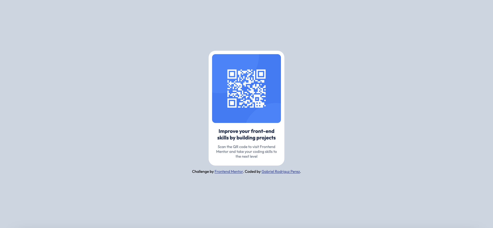

# Frontend Mentor - QR code component solution

This is a solution to the [QR code component challenge on Frontend Mentor](https://www.frontendmentor.io/challenges/qr-code-component-iux_sIO_H). Frontend Mentor challenges help you improve your coding skills by building realistic projects.

## Table of contents

- [Overview](#overview)
  - [Screenshot](#screenshot)
  - [Links](#links)
- [My Process](#my-process)
  - [Built With](#built-with)
  - [What I Learned](#what-i-learned)
  - [Continued Development](#continued-development)
  - [Useful Resources](#useful-resources)
- [Author](#author)

## Overview

### Screenshot



### Links

- Solution URL: [Add solution URL here](https://your-solution-url.com)
- Live Site URL: [Add live site URL here](https://your-live-site-url.com)

## My Process

### Built with

- Semantic HTML5
- CSS Flexbox
- Mobile-first design principles
- Google Fonts (Outfit)

### What I Learned

This challenge helped reinforce the importance of:

- Using the `meta viewport` tag for proper mobile scaling
- Structuring components with Flexbox for responsiveness
- Utilizing relative units like `max-width` and `auto` height for adaptable layouts

Here’s a snippet I’m proud of:

```
css
.qr-code img {
  width: 100%;
  max-width: 250px;
  height: auto;
  border-radius: 10px;
}
```
This allowed the image to scale nicely on both desktop and mobile while maintaining a clean rounded border.

### Continued Development
I’d like to further improve:

My understanding of accessibility and alt text usage

More advanced responsive design techniques using media queries

Building components with more reusable CSS

### Useful Resources
[***MDN - Responsive Design Basics***](https://developer.mozilla.org/en-US/docs/Learn_web_development/Core/CSS_layout/Responsive_Design)

[***CSS Tricks - Flexbox Guide***](https://css-tricks.com/snippets/css/a-guide-to-flexbox/)

## Author
Gabriel L. Rodriguez Perez

Frontend Mentor - @glrodriperez98

Github - glrodriperez98